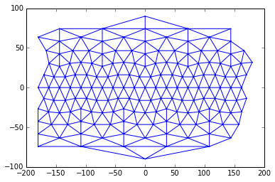

# PyGeoTess

GeoTess for Python programmers.

PyGeoTess is a Python interface module to the
[GeoTess](http://www.sandia.gov/geotess) gridding and earth model library from
Sandia National Laboratories.  It provides two interfaces to a subset of the
GeoTess library: a direct interface to the GeoTess c++ classes and methods,
and a more Pythonic interface.




## Installation

PyGeoTess currently requires a C++ compiler.  In the future, binary wheels may be available on PyPI.

### GeoTessCPP

First, install GeoTessCPP >= 2.7, the underlying C++ library powering PyGeoTess,
available from Conda-Forge or directly from the [SNL repository](https://github.com/sandialabs/GeoTessCPP):

With conda:

```bash
conda install -c conda-forge geotesscpp
```

NOTE: Using PyGeoTess with `geotesscpp` installed from the main SNL repository does not currently work.


### PyGeoTess

To install centrally from this repo: `pip install .`

To install an "editable" local installation from this repo: `pip install -e .`


## Roadmap

1. Add tests, initially mirroring those from GeoTessCPP.
2. Clean up API, due to expedient merging of work from contributors.
3. Reorganize package, following outline below.  The idea is to have CPP/Python mirrored naming, distinguished only by import statements.
```
geotess\
    __init__.py
    model.py
    grid.py
    exc.py
    libgeotess.so/dylib
    lib/
        __init__.pyd # makes "cimport geotess.lib as clib" work in Cython. "import geotess.lib as clib; clib.GeoTessModel"
        __init__.py  # makes GeoTessCPP objects from C++ available to Cython. "import geotess.lib as lib; lib.GeoTessModel"
        GeoTessModel.pxd # "cimport geotess.lib as clib; clib.GeoTessModel". makes GeoTessCPP objects from C++ available to Cython.  
        GeoTessModel.pyx # "import geotess.lib as lib; lib.GeoTessModel". implements Python GeoTess objects using the C++ objects above.  
        EarthShape.pyd
        EarthShape.pyx
        ...
```
4. Incorporate functionality from GeoTessExplorer/GeoTessBuilder
5. Improve docs

