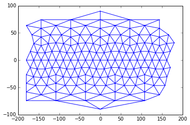

# PyGeoTess

GeoTess for Python programmers.

PyGeoTess is a Python interface module to the
[GeoTess](http://www.sandia.gov/geotess) gridding and earth model library from
Sandia National Laboratories.  It provides two interfaces to a subset of the
GeoTess library: a direct interface to the GeoTess c++ classes and methods,
and a more Pythonic interface.




## Installation

PyGeoTess requires a C++ compiler and GeoTessCPP >= 2.7.

### With Pixi (recommended for development)

[Pixi](https://pixi.sh) handles all dependencies including compilers and GeoTessCPP:

```bash
pixi install
pixi run build  # Build Cython extensions
pixi run test   # Run tests
```

### Manual Installation

First, install GeoTessCPP >= 2.7 from Conda-Forge:

```bash
conda install -c conda-forge geotesscpp
```

> [!WARNING]
> Using PyGeoTess with GeoTessCPP installed from the main SNL repository does not currently work.
> The header files need to be in a `geotesscpp` directory in the standard system include path,
> and libraries in the standard library search path (e.g. `$CONDA_PREFIX/lib` and `$CONDA_PREFIX/include/geotesscpp`).

Then install PyGeoTess:

```bash
pip install .              # Standard install
pip install -e .           # Editable install for development
```


## Roadmap

1. Reorganize package, following outline below.  The idea is to have CPP/Python mirrored naming, distinguished only by import statements.
2. Add tests, initially mirroring those from GeoTessCPP.
3. Clean up API, due to expedient merging of work from contributors.
4. Move from setuptools to scikit-build-core for the build-backend.
```
geotess\
    __init__.py
    model.py
    grid.py
    exc.py
    libgeotess.so/dylib
    lib/
        __init__.pyd # makes "cimport geotess.lib as clib" work in Cython. "import geotess.lib as clib; clib.GeoTessModel"
        __init__.py  # makes GeoTessCPP objects from C++ available to Cython. "import geotess.lib as lib; lib.GeoTessModel"
        GeoTessModel.pxd # "cimport geotess.lib as clib; clib.GeoTessModel". makes GeoTessCPP objects from C++ available to Cython.  
        GeoTessModel.pyx # "import geotess.lib as lib; lib.GeoTessModel". implements Python GeoTess objects using the C++ objects above.  
        EarthShape.pyd
        EarthShape.pyx
        ...
```
4. Incorporate functionality from GeoTessExplorer/GeoTessBuilder
5. Improve docs

