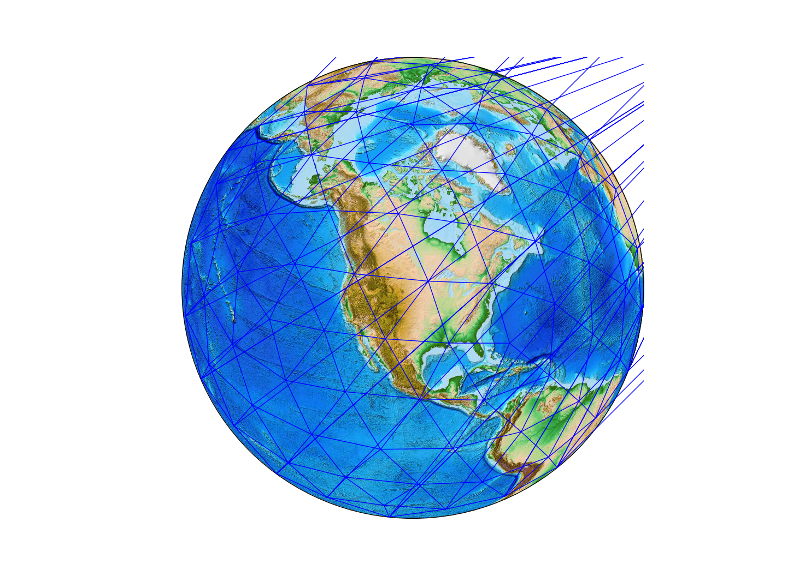
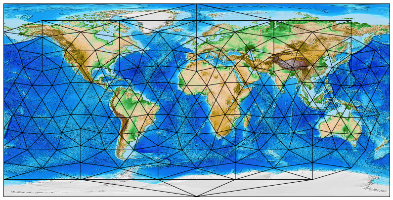

## Load a grid

Grids are made using a Java utility called `GeoTessBuilder`.  Loading them into
memory from file is the standard constructor in PyGeoTess.  Viewing grid metadata is as simple as using `print` or `str`.


```python
from geotess import Grid

grid = Grid('geotess/data/geotess_grid_16000.geotess')
print(grid)
```

```
GeoTessGrid
gridID = 4FD3D72E55EFA8E13CA096B4C8795F03
memory : 0.11776 MB
input Grid File : geotess/data/geotess_grid_16000.geotess
generated by software version : GridBuilder 0.0.0  Fri May 25 11:34:59 MDT 2012

nTessellations = 1
nLevels = 3
nVertices = 162
nTriangles = 420

    Tess    Level  LevelID     NTri    First   Last+1
      0        0        0       20        0       20
      0        1        1       80       20      100
      0        2        2      320      100      420
```


## Built-in grids

The grids and models that GeoTess distributes are also part of PyGeoTess.  The files are found in `geotess/data`, but they are also pre-loaded into class instances.  Here, we simply import the previous grid.

```python
from geotess.data import grid_16000

print(grid_16000)
```

```
GeoTessGrid
gridID = 4FD3D72E55EFA8E13CA096B4C8795F03
memory : 0.11776 MB
input Grid File : geotess/data/geotess_grid_16000.geotess
generated by software version : GridBuilder 0.0.0  Fri May 25 11:34:59 MDT 2012

nTessellations = 1
nLevels = 3
nVertices = 162
nTriangles = 420

    Tess    Level  LevelID     NTri    First   Last+1
      0        0        0       20        0       20
      0        1        1       80       20      100
      0        2        2      320      100      420
```


## Vertices and triangles

In PyGeoTess, Grid vertices are geocentric coordinates of points of intersection on a tessellation, and triangles are the three integer vertex indices that form a triangle in the tessellation.  For a given grid, all vertices are accessible via the `Grid.vertices` method, and the triangles (vertex associations) for a particular tessellation and level are gotten with the `Grid.triangles` method.


```python
vertices = grid.vertices()
triangles = grid.triangles(tess=0, level=2)

print("The first 10 vertices are:\n{}".format(vertices[:10]))
print("The first 10 triangles are:\n{}".format(triangles[:10]))
```

```
The first 10 vertices are:
[[   0.           90.        ]
 [  72.           26.71930078]
 [   0.           26.71930078]
 [ 144.           26.71930078]
 [-144.           26.71930078]
 [ -72.           26.71930078]
 [  36.          -26.71930078]
 [ 108.          -26.71930078]
 [-180.          -26.71930078]
 [-108.          -26.71930078]]
The first 10 triangles are:
[[42 43 44]
 [12 44 43]
 [13 42 44]
 [14 43 42]
 [42 45 46]
 [ 0 46 45]
 [14 42 46]
 [13 45 42]
 [43 47 48]
 [ 1 48 47]]
```

## Plotting grids

The methods for vertices and triangles above makes them amenable to plotting using Matplotlib's [`triplot`](http://matplotlib.org/1.5.0/examples/pylab_examples/triplot_demo.html) function.


```python
import matplotlib.pyplot as plt

plt.triplot(vertices[:,0], vertices[:,1], triangles);
```





The cirularity of vertex longitudes makes plotting tricky.  Luckily, Matplotlib has the tools ['Triangulation'](http://matplotlib.org/api/tri_api.html#matplotlib.tri.Triangulation) and ['TriAnalyzer'](http://matplotlib.org/api/tri_api.html#matplotlib.tri.TriAnalyzer) to mask out these long, flat triangles from the plot!

```python
from matplotlib.tri import Triangulation, TriAnalyzer

tri = Triangulation(vertices[:,0], vertices[:,1], triangles)
tri_an = TriAnalyzer(tri)

mask = tri_an.get_flat_tri_mask(min_circle_ratio=0.1, rescale=True)
plt.triplot(vertices[:,0], vertices[:,1], triangles, mask=mask)
```


Now, let's plot them on a real map, using Matplotlib [Basemap](http://matplotlib.org/basemap/users/examples.html)!


```python
from mpl_toolkits.basemap import Basemap

plt.figure(figsize=(15,7))
m = Basemap()
m.etopo()
x, y = m(vertices[:,0], vertices[:,1])
plt.triplot(x, y, triangles, mask=mask, color='k')
```





Not perfect, but not as messy.
