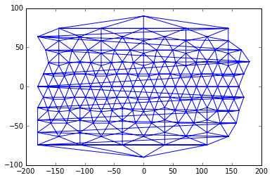

## Tutorial

### Working with grids

#### Load a grid

Grids are made using a Java utility called `GeoTessBuilder`.  Loading them into
memory from file is the standard constructor in PyGeoTess.  Viewing grid metadata is as simple as using `print` or `str`.

    from geotess import Grid
    
    grid = Grid('geotess/data/geotess_grid_16000.geotess')
    print(grid)

    GeoTessGrid
    gridID = 4FD3D72E55EFA8E13CA096B4C8795F03
    memory : 0.11776 MB
    input Grid File : geotess/data/geotess_grid_16000.geotess
    generated by software version : GridBuilder 0.0.0  Fri May 25 11:34:59 MDT 2012
    
    nTessellations = 1
    nLevels = 3
    nVertices = 162
    nTriangles = 420
    
        Tess    Level  LevelID     NTri    First   Last+1
          0        0        0       20        0       20
          0        1        1       80       20      100
          0        2        2      320      100      420
    
    

#### Built-in grids

The grids and models that GeoTess distributes are also part of PyGeoTess.  The files are found in `geotess/data`, but they are also pre-loaded into class instances.  Here, we simply import the previous grid.

    from geotess.data import grid_16000
    
    print(grid_16000)

    GeoTessGrid
    gridID = 4FD3D72E55EFA8E13CA096B4C8795F03
    memory : 0.11776 MB
    input Grid File : geotess/data/geotess_grid_16000.geotess
    generated by software version : GridBuilder 0.0.0  Fri May 25 11:34:59 MDT 2012
    
    nTessellations = 1
    nLevels = 3
    nVertices = 162
    nTriangles = 420
    
        Tess    Level  LevelID     NTri    First   Last+1
          0        0        0       20        0       20
          0        1        1       80       20      100
          0        2        2      320      100      420
    
    

#### Get vertices and triangles

In PyGeoTess, Grid vertices are geocentric coordinates of points of intersection on a tessellation, and triangles are the three integer vertex indices that form a triangle in the tessellation.  For a given grid, all vertices are accessible via the `Grid.vertices` method, and the triangles (vertex associations) for a particular tessellation and level are gotten with the `Grid.triangles` method.

    vertices = grid.vertices()
    triangles = grid.triangles(tess=0, level=2)
    
    print("The first 10 vertices are:\n{}".format(vertices[:10]))
    print("The first 10 triangles are:\n{}".format(triangles[:10]))

    The first 10 vertices are:
    [[   0.           90.        ]
     [  72.           26.71930078]
     [   0.           26.71930078]
     [ 144.           26.71930078]
     [-144.           26.71930078]
     [ -72.           26.71930078]
     [  36.          -26.71930078]
     [ 108.          -26.71930078]
     [-180.          -26.71930078]
     [-108.          -26.71930078]]
    The first 10 triangles are:
    [[42 43 44]
     [12 44 43]
     [13 42 44]
     [14 43 42]
     [42 45 46]
     [ 0 46 45]
     [14 42 46]
     [13 45 42]
     [43 47 48]
     [ 1 48 47]]

#### Plotting grids

The methods for vertices and triangles above makes them ammenable to plotting using Matplotlib's [`triplot`](http://matplotlib.org/1.5.0/examples/pylab_examples/triplot_demo.html) function.

    %matplotlib inline
    import matplotlib.pyplot as plt
    
    plt.triplot(vertices[:,0], vertices[:,1], triangles)

    [<matplotlib.lines.Line2D at 0x10f974910>,
     <matplotlib.lines.Line2D at 0x10f9749d0>]

The cirularity of vertex longitudes makes plotting trick.  Luckily, Matplotlib has the tools ['Triangulation'](http://matplotlib.org/api/tri_api.html#matplotlib.tri.Triangulation) and ['TriAnalyzer'](http://matplotlib.org/api/tri_api.html#matplotlib.tri.TriAnalyzer) to mask out these long, flat triangles from the plot!

    from matplotlib.tri import Triangulation, TriAnalyzer
    
    tri = Triangulation(vertices[:,0], vertices[:,1], triangles)
    tri_an = TriAnalyzer(tri)
    
    mask = tri_an.get_flat_tri_mask(min_circle_ratio=0.1, rescale=True)
    plt.triplot(vertices[:,0], vertices[:,1], triangles, mask=mask)

    [<matplotlib.lines.Line2D at 0x10be6b5d0>,
     <matplotlib.lines.Line2D at 0x10be6b690>]

Now, let's plot them on a real map, using Matplotlib [Basemap](http://matplotlib.org/basemap/users/examples.html)!

    from mpl_toolkits.basemap import Basemap
    
    plt.figure(figsize=(15,7))
    m = Basemap()
    m.etopo()
    plt.triplot(vertices[:,0], vertices[:,1], triangles, mask=mask, color='k')

    [<matplotlib.lines.Line2D at 0x13cac9c90>,
     <matplotlib.lines.Line2D at 0x13d3c4f50>]

Not perfect, but not as messy.

### Working with Models

Models can be loaded from file, or constructed from scratch (a grid file is still required).

#### Load from file

    from geotess import Model
    
    model = Model.read('geotess/data/crust20.geotess')
    print(model)

    
    ********************************************************************************
    
    GeoTessModel:
    OS: Undefined 64-bit mode
    Input Model File: geotess/data/crust20.geotess
    Input Grid File: *
    
    Generated by: GeoModel 7.0.1  Wed April 18 15:21:51 2012
    Model Load Time: 0.000 sec
    Memory footprint: 18.5971 MB
    
    Model Description: 
    The Crust 2.0 model of Bassin, Laske and Masters (2000).
    
    Bassin, C., Laske, G. and Masters, G., 
    The Current Limits of Resolution for Surface Wave 
    Tomography in North America, EOS Trans AGU, 81, F897, 2000.
    
    http://igppweb.ucsd.edu/~gabi/crust2.html
    
    The original model was defined on a regular latitude-longitude
    grid with 2 degree by 2 degree spacing.  It was cell-based,
    meaning that the model attributes (p velocity, s velocity and
    density) were attached to the cells, not the nodes at the 
    corners of the cells.
    
    This representation uses a triangular tessellation with 
    1 degree edge lengths and it is node based, meaning that
    the attributes are attached to the nodes at the corners
    of the triangles, not the triangles.  The translation
    was accomplished by first defining a node at the center 
    of each 2 degree cell in the original model and then
    interpolating attribute values at the nodes of the 
    new model using simple bi-linear interpolation.  There
    was certainly some interpolation error involved in this 
    process.
    
    In this representation, the water layer has been omitted.
    The top of the new model is the surface of the solid 
    Earth.  While the thickness of the water layer in the 
    oceans can be deduced in the new model by assuming that
    the surface of the oceans corresponds to depth zero, the
    thickness of the water layer in large inland lakes and
    seas has been lost.
    
    In the new representation, layer boundaries are defined in 
    terms of radius, not depth.  Depths in the original model
    were converted to radius using the radius of the WGS84
    ellipsoid.
    
    Sandy Ballard
    Sandia National Laboratories
    sballar@sandia.gov
    4/14/2012
    <end description>
    
    EarthShape: WGS84
    DataType: FLOAT
    Attributes: 
      0:  vp  (km/sec)
      1:  vs  (km/sec)
      2:  density  (g/cc)
    
    Layers: 
      Index  TessId    Name
       6       0     ice
       5       0     soft_sediments
       4       0     hard_sediments
       3       0     upper_crust
       2       0     middle_crust
       1       0     lower_crust
       0       0     mantle
    
    
    Layer  connected   number    profile   profile    profile  profile  profile  profile
    Index  vertices   of points  npoints   constant    thin     empty   surface surfemtpy
    -----  --------   ---------  -------   --------   ------   -------  -------  -------
       6    40962        40962         0       1542    39420         0       0       0
       5    40962        40962         0      39267     1695         0       0       0
       4    40962        40962         0      13561    27401         0       0       0
       3    40962        40962         0      40962        0         0       0       0
       2    40962        40962         0      40962        0         0       0       0
       1    40962        40962         0      40962        0         0       0       0
       0    40962        40962         0          0    40962         0       0       0
    -----  --------   ---------  -------   --------   ------   -------  -------  -------
    Total   40962       286734         0     177256   109478         0       0       0
    
    GeoTessGrid
    gridID = 808785948EB2350DD44E6C29BDEA6CAE
    memory : 34.2188 MB
    input Grid File : geotess/data/crust10.geotess
    generated by software version : GeoModel 7.0.1  Wed April 18 15:21:51 2012
    
    nTessellations = 1
    nLevels = 7
    nVertices = 40962
    nTriangles = 109220
    
        Tess    Level  LevelID     NTri    First   Last+1
          0        0        0       20        0       20
          0        1        1       80       20      100
          0        2        2      320      100      420
          0        3        3     1280      420     1700
          0        4        4     5120     1700     6820
          0        5        5    20480     6820    27300
          0        6        6    81920    27300   109220
    
    
    ********************************************************************************
    

Each `Model` has a `.grid`, which provides access to that Model's Grid instance.

Just like with `Grids`, PyGeoTess is distribed with the same GeoTess model files, like Crust2.0, which can be directly imported.

    from geotess.data import crust20
    
    print(crust20)

    
    ********************************************************************************
    
    GeoTessModel:
    OS: Undefined 64-bit mode
    Input Model File: geotess/data/crust20.geotess
    Input Grid File: *
    
    Generated by: GeoModel 7.0.1  Wed April 18 15:21:51 2012
    Model Load Time: 1.000 sec
    Memory footprint: 18.5971 MB
    
    Model Description: 
    The Crust 2.0 model of Bassin, Laske and Masters (2000).
    
    Bassin, C., Laske, G. and Masters, G., 
    The Current Limits of Resolution for Surface Wave 
    Tomography in North America, EOS Trans AGU, 81, F897, 2000.
    
    http://igppweb.ucsd.edu/~gabi/crust2.html
    
    The original model was defined on a regular latitude-longitude
    grid with 2 degree by 2 degree spacing.  It was cell-based,
    meaning that the model attributes (p velocity, s velocity and
    density) were attached to the cells, not the nodes at the 
    corners of the cells.
    
    This representation uses a triangular tessellation with 
    1 degree edge lengths and it is node based, meaning that
    the attributes are attached to the nodes at the corners
    of the triangles, not the triangles.  The translation
    was accomplished by first defining a node at the center 
    of each 2 degree cell in the original model and then
    interpolating attribute values at the nodes of the 
    new model using simple bi-linear interpolation.  There
    was certainly some interpolation error involved in this 
    process.
    
    In this representation, the water layer has been omitted.
    The top of the new model is the surface of the solid 
    Earth.  While the thickness of the water layer in the 
    oceans can be deduced in the new model by assuming that
    the surface of the oceans corresponds to depth zero, the
    thickness of the water layer in large inland lakes and
    seas has been lost.
    
    In the new representation, layer boundaries are defined in 
    terms of radius, not depth.  Depths in the original model
    were converted to radius using the radius of the WGS84
    ellipsoid.
    
    Sandy Ballard
    Sandia National Laboratories
    sballar@sandia.gov
    4/14/2012
    <end description>
    
    EarthShape: WGS84
    DataType: FLOAT
    Attributes: 
      0:  vp  (km/sec)
      1:  vs  (km/sec)
      2:  density  (g/cc)
    
    Layers: 
      Index  TessId    Name
       6       0     ice
       5       0     soft_sediments
       4       0     hard_sediments
       3       0     upper_crust
       2       0     middle_crust
       1       0     lower_crust
       0       0     mantle
    
    
    Layer  connected   number    profile   profile    profile  profile  profile  profile
    Index  vertices   of points  npoints   constant    thin     empty   surface surfemtpy
    -----  --------   ---------  -------   --------   ------   -------  -------  -------
       6    40962        40962         0       1542    39420         0       0       0
       5    40962        40962         0      39267     1695         0       0       0
       4    40962        40962         0      13561    27401         0       0       0
       3    40962        40962         0      40962        0         0       0       0
       2    40962        40962         0      40962        0         0       0       0
       1    40962        40962         0      40962        0         0       0       0
       0    40962        40962         0          0    40962         0       0       0
    -----  --------   ---------  -------   --------   ------   -------  -------  -------
    Total   40962       286734         0     177256   109478         0       0       0
    
    GeoTessGrid
    gridID = 808785948EB2350DD44E6C29BDEA6CAE
    memory : 34.2188 MB
    input Grid File : geotess/data/crust10.geotess
    generated by software version : GeoModel 7.0.1  Wed April 18 15:21:51 2012
    
    nTessellations = 1
    nLevels = 7
    nVertices = 40962
    nTriangles = 109220
    
        Tess    Level  LevelID     NTri    First   Last+1
          0        0        0       20        0       20
          0        1        1       80       20      100
          0        2        2      320      100      420
          0        3        3     1280      420     1700
          0        4        4     5120     1700     6820
          0        5        5    20480     6820    27300
          0        6        6    81920    27300   109220
    
    
    ********************************************************************************
    

### Create a Model from scratch

Creating a GeoTessModel from scratch requires a grid file, some layers, and some attributes.  PyGeoTess describes layers with 2-tuples.  The first entry is the layer name, the second is the correspoding tessellation id.  Similarly, with names and units, for attributes.  Convenience [`namedtuple`](https://docs.python.org/2/library/collections.html#collections.namedtuple) are provided, for readability.

    # look at the grid, so you can assign layers to tessellation ids.
    from geotess.data import grid_16000
    from geotess import Model, Layer, Attribute
    
    print(grid_16000)

    GeoTessGrid
    gridID = 4FD3D72E55EFA8E13CA096B4C8795F03
    memory : 0.11776 MB
    input Grid File : geotess/data/geotess_grid_16000.geotess
    generated by software version : GridBuilder 0.0.0  Fri May 25 11:34:59 MDT 2012
    
    nTessellations = 1
    nLevels = 3
    nVertices = 162
    nTriangles = 420
    
        Tess    Level  LevelID     NTri    First   Last+1
          0        0        0       20        0       20
          0        1        1       80       20      100
          0        2        2      320      100      420
    
    

    crust = Layer(name='crust', tess_id=0)
    mantle = Layer('mantle', 0)
    
    Vp = Attribute(name='Vp', unit='km/s')
    Vs = Attribute('Vs', 'km/s')
    
    desc = "My awesome model."
    model = Model('geotess/data/geotess_grid_16000.geotess', layers=[crust, mantle], attributes=[Vp, Vs], 
                  dtype='float', earth_shape='wgs84', rconst=False, description=desc)
    
    print(model)

    
    ********************************************************************************
    
    GeoTessModel:
    OS: Undefined 64-bit mode
    Input Model File: none
    Input Grid File: geotess/data/geotess_grid_16000.geotess
    
    Generated by: PyGeoTess v0.1.1  2015-11-18 15:35:20.303894
    Model Load Time: -1.000 sec
    Memory footprint: 0.000646591 MB
    
    Model Description: 
    My awesome model.
    <end description>
    
    EarthShape: WGS84
    DataType: FLOAT
    Attributes: 
      0:  Vp  (km/s)
      1:  Vs  (km/s)
    
    Layers: 
      Index  TessId    Name
       1       0     MANTLE
       0       0     CRUST
    
    
    GeoTessGrid
    gridID = 4FD3D72E55EFA8E13CA096B4C8795F03
    memory : 0.11776 MB
    input Grid File : geotess/data/geotess_grid_16000.geotess
    generated by software version : GridBuilder 0.0.0  Fri May 25 11:34:59 MDT 2012
    
    nTessellations = 1
    nLevels = 3
    nVertices = 162
    nTriangles = 420
    
        Tess    Level  LevelID     NTri    First   Last+1
          0        0        0       20        0       20
          0        1        1       80       20      100
          0        2        2      320      100      420
    
    
    ********************************************************************************
    

Now, let's save it.

    # binary version
    model.write('myawesome.geotess')
    
    # ascii version
    model.write('myawesome.ascii')

## Roadmap

Make PyGeoTess work with both the standard CPython interpretor, using the GeoTess
c++ library and Cython, and the [Jython](http://jython.org) Python interpeter,
using the GeoTess Java library.
